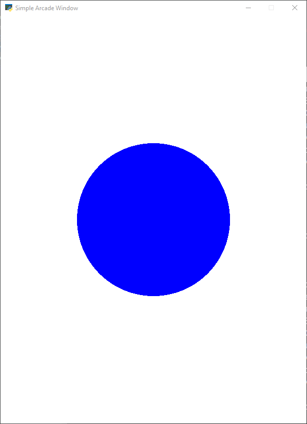

# arcade-tutorial

A simple side-scroll game build with Python the Arcade package. Follows a tutorial on RealPython.com

## To Run

```
git clone https://github.com/ProfessorKazarinoff/arcade-tutorial.git
cd arcade-tutorial
python -m venv venv
venv\Scritps\activate.bat
pip install -r requirements.txt
python run.py
```

The ```arcade_basic.py``` window should look something like the window below.


